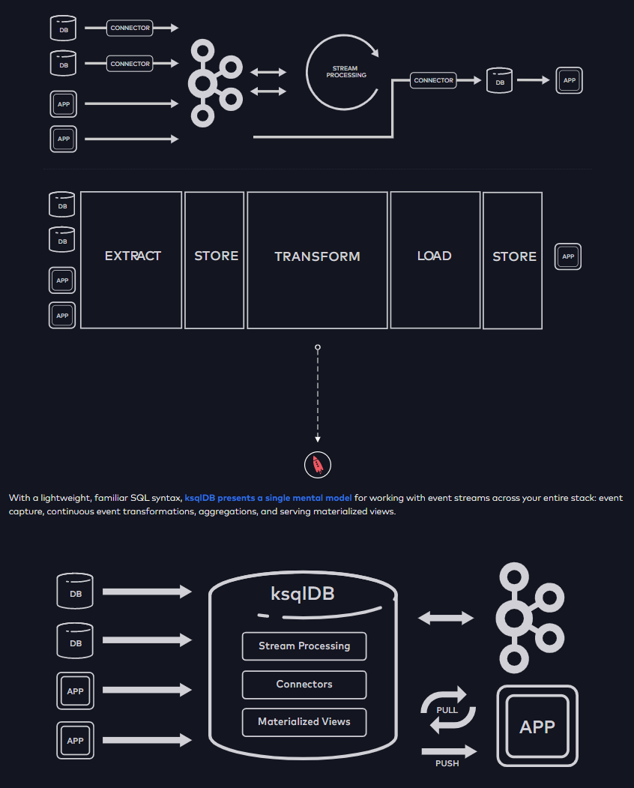

Wednesday 9 February 2022
===

# Mozart > Prototypes > Prototype1

Δε χρειαζόμαστε άλλη μία βιβλιοθήκη για abstractions ούτε ένα ακόμα DSL για να χτίζουμε concurrent, 
distributed, event-driven applications.  
Π.χ. akka, axon, spring cloud stream, κτλ. Ίσως για αυτό το Kafka γνώρισε πολύ μεγάλη επιτυχία. 
Εστιάζει στο να έιναι ένας αξιόπιστος (σίγουρα όχι πλήρης) broker 
αλλά με πολύ ξεκάθαρες δυνατότητες και προωθεί την ευελιξία στο application layer και στην ευχέρια του engineer. 

Αντιθέτως, απαιτείται μια καλή μοντελοποίηση μιας event-driven αρχιτεκτονικής και καθιέρωση μιας ενιαίας γλώσσας επικοινωνίας. 
Για παράδειγμα, ότι είναι το Domain-Driven Development σε συνδυασμό με το Clean Architecture.  

- Primitives, definitions, semantics
- Blocking / non-blocking
- Bounded / unbounded
- Δεδομένα και δομές δεδομένων (π.χ. χρονοσειρά, γράφος, etc)
- Πρωτόκολλα ανταλλαγή δεδομένων
- Πρωτόκολλα αναπαράστασης δεδομένων
- Και προφανώς η φυσική αναπαράσταση όλων των παραπάνω σε Java **κλάσεις**

Π.χ. το [ksqldb](https://ksqldb.io/) δημιουργεί DSL που δημιουργεί με τη σειρά του κώδικα που δημιουργεί 
με τη σειρά του τοπολογία για Kafka μέσα από μία γλώσσα που μοιάζει πολύ με την SQL.  

